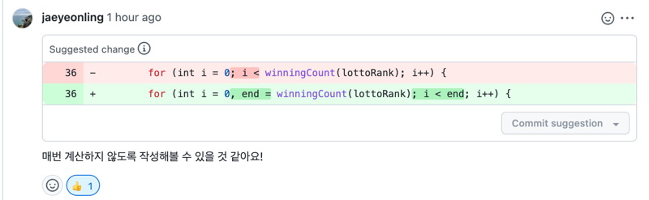

# 로또
## 진행 방법
* 로또 요구사항을 파악한다.
* 요구사항에 대한 구현을 완료한 후 자신의 github 아이디에 해당하는 브랜치에 Pull Request(이하 PR)를 통해 코드 리뷰 요청을 한다.
* 코드 리뷰 피드백에 대한 개선 작업을 하고 다시 PUSH한다.
* 모든 피드백을 완료하면 다음 단계를 도전하고 앞의 과정을 반복한다.

## 온라인 코드 리뷰 과정
* [텍스트와 이미지로 살펴보는 온라인 코드 리뷰 과정](https://github.com/next-step/nextstep-docs/tree/master/codereview)

## 1단계 - 학습 테스트 실습
* String 클래스 학습
  * split()
  * contains()
  * containsExactly()
  * substring()
  * charAt()
  * StringIndexOutOfBoundsException
  * Junit @DisplayName 활용
    

* Set Collection 학습
  * size()
  * contains()
  * Junit ParameterizedTest 활용

## 2단계 - 문자열 덧셈 계산기
* [X] TDD/리팩토링 실습
  * [X] 프로그래밍 요구사항
    * [X] intent depth 1단계
    * [X] 메소드 라인 10 이하로 작성
      * [X] 메소드가 한 가지 일만 하도록 처리
    * [X] else 사용 금지
  * [X] 기능 요구사항
    * [X] 빈문자열, null일 경우 0 반환
      * (예 : “” => 0, null => 0)
    * [X] 숫자하나를 문자열로 입력받으면 그대로 반환
      * (예 : “1”)
    * [X] 숫자 두 개를 컴마(,) 또는 콜론(:)을 구분자로 입력받으면 두 숫자 합 반환'
      * (예 : “1,2:3” => 6)
    * [X] "//" 와 "\n" 문자 사이 커스텀 구분자 
      * (예 : “//;\n1;2;3” => 6)
    * [X] 예외처리
      * [X] 음수
      * [X] 숫자 외의 문자

# 3단계 - 로또(자동)
* Todo 리스트
  * 로또 구입 금액을 입력받는다
  * 로또를 구매한다
    * 로또는 1장에 1000원
    * 금액만큼 로또를 자동으로 생성한다
  * 지난주 당첨 번호르 입력 받는다
  * 당첨 결과를 출력한다
    * 로또 1장씩 결과를 찾아 반환
    * 결과클래스에 상태값 저장
  * 로또 일치수 & 당첨금액 관리하는 enum 클래스를 만든다

* 반영목록
  * [X] domain
    * [X] LottoNumber - 로또번호 1~45 캐싱 및 유효성 체크
    * [X] Lotto - 로또번호 6개를 저장
    * [X] LottoFactory - Lotto 객체를 생산하는 클래스
      * [X] 자동로또 객체 반환
      * [X] 로또번호 String 문자열을 로또객체로 반환(,로 구분)
    * [X] Lottos - 구매한 로또 번호들을 가지는 클래스
    * [X] Money - 구매금액 관련 클래스
      * [X] 1000원 이하면 예외발생
      * [X] krw 변환 문자열 반환
    * [X] Quantity - 구매수량
      * [X] 구매가능 수량 초과시 예외발생
    * [X] LottoGame - 로또 상태를 가지는 클래스
    * [X] LottoResult - 당첨결과 클래스
      * [X] 수익률 반환
    * [X] LottoRank - 금액, 등수별 매칭개수를 관리하는 enum 클래스
  * [X] controller
    *[X] App - 입력 및 결과를 제어
  * [X] view
    * [X] InputView - 구매관련 값을 입력 받는 클래스
    * [X] ResultView - 결과를 화면에 출력하는 클래스

* 리뷰어(김재연 님) 코드리뷰
  * 컬렉션 방어적 복사
    * [X] 외부에서 객체 조작방지
  * 쓸데없는 예외처리 메시지 상수화 의문제기
    * [X] 코드만 늘어나고 특별히 이득이 없으므로 상수화된 변수들 제거
  * 정적 팩토리 메서드는 생성자 아래 위치하는 것이 관례
    * [X] 반영완료
  * LottoResult 멤버변수명 변경 제안
    * [x] LottoResult.lottoResult -> LottoResult.winningRank
  * Optional Null 체크 대신 if문 제안
    * [x] if 문 변경 완료
  * 캐싱된 LottoNumbers 객체 Thread-safe 제안
    * [X] 방어적 복사 적용
  * 캐싱 객체 테스트 검증필요
    * [X] equals&hashCode 오버라이딩 삭제
    * [X] 테스트 코드 반영

# 4단계 - 로또(2등)
* 요구사항
  * 보너스 번호를 추가로 입력 받음
  * 당첨 통계에 2등 추가

* 반영목록
  * [X] View
    * [X] InputView
      * [X] 보너스번호 입력
    * [X] ResultView
      * [X] 2등 출력
  * [X] Domain
    * [x] WinningNumber
      * [X] 우승로또번호와 보너스 번호를 감싼 객체
    * [X] LottoRank
      * [X] 2등 매치, 상금 정보 
      * [X] winningMoney int 형을 Money 객체로 변경
      * [X] 상금 합계 기능
    * [X] LottoResult
      * [X] 생성자 인자 WinningNumber 객체로 변경
  * [X] Controller
    * [X] 보너스 번호

* 리뷰어(김재연 님) 코드리뷰
  * [X] Map<Integer, LottoNumber> lottoNumbersCache 변수명 변경
    * -> cachedLottoNumberGroup
  * [X] Map 컬렉션 get() -> getOrDefault() 활용
  * [X] for 문 조건식에 계산 메서드 사용 금지
    
  * [X] LottoRank.of 메서드 2등 구하는 로직 개선
    * bonus 멤버변수 추가
